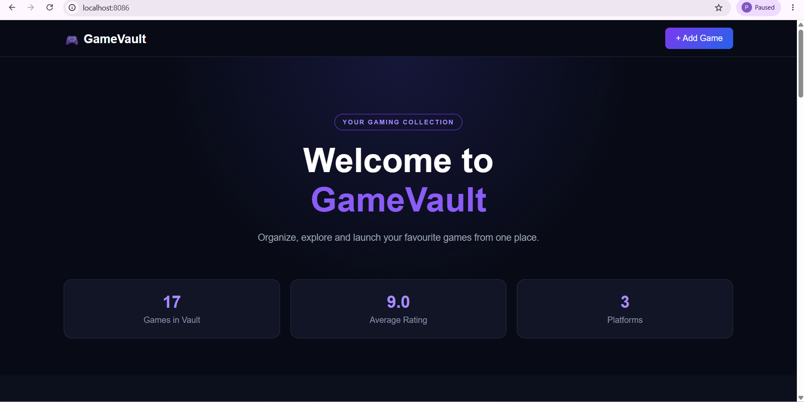
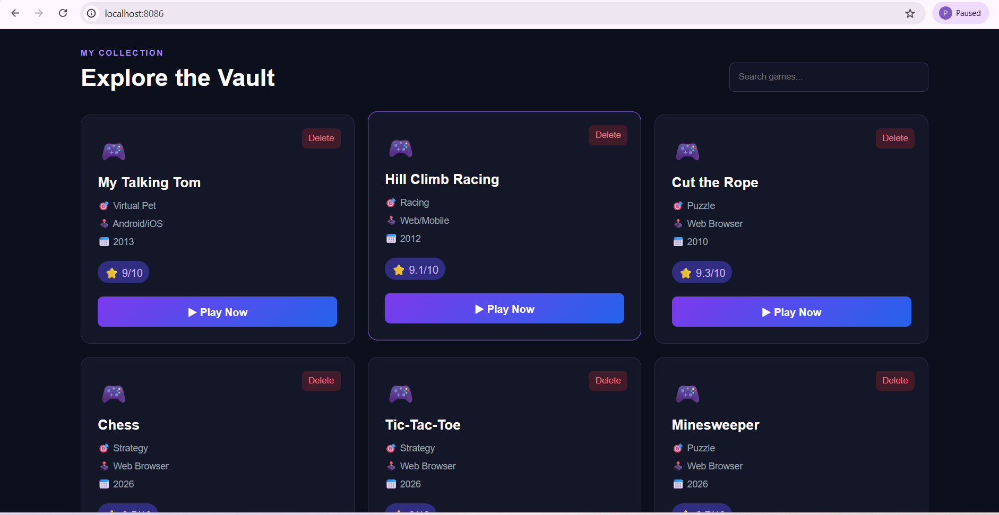
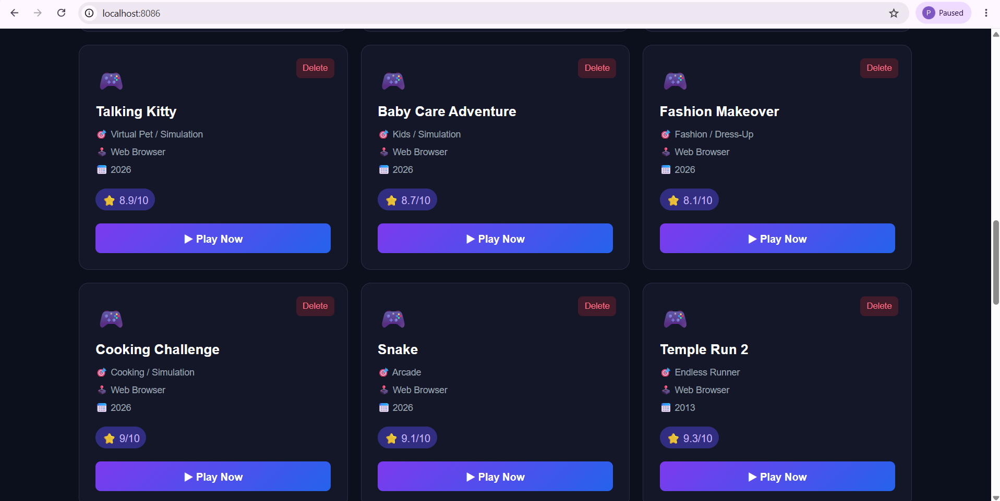
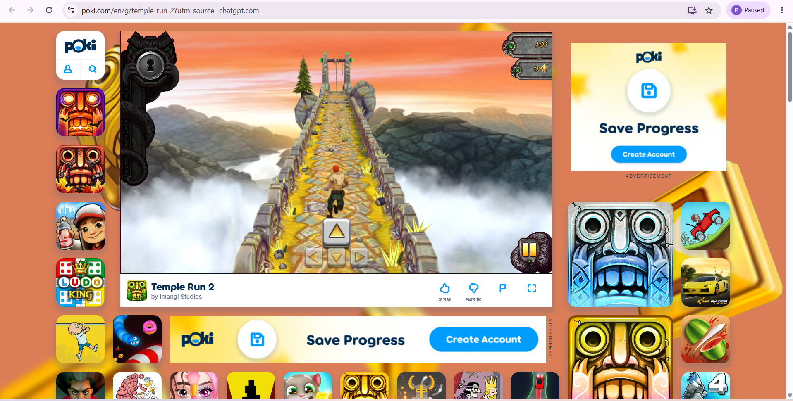
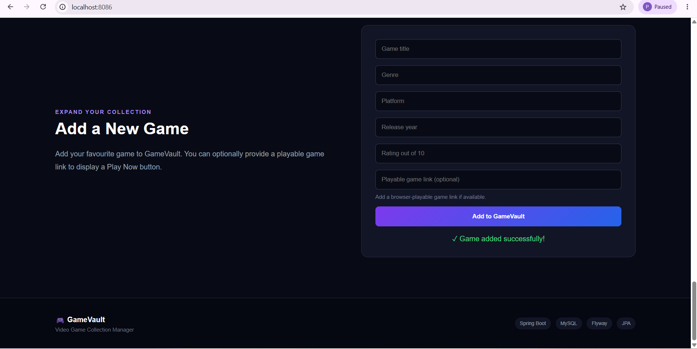

# 🎮 GameVault

GameVault is a full-stack game management web application built using Spring Boot and MySQL. It allows users to explore, search, add, delete, and access online games through a modern gaming interface.

## 🚀 Features

- 🎮 Explore a collection of games
- 🔍 Search games by title or genre
- ➕ Add new games dynamically
- 🗑️ Delete games
- ▶️ Play games using integrated game links
- 📊 Dynamic game statistics
- 💾 Permanent MySQL database storage
- 📱 Responsive and modern user interface

## 🛠️ Technologies Used

- Java
- Spring Boot
- Spring Data JPA
- MySQL
- Flyway Database Migration
- HTML
- CSS
- JavaScript
- Maven
- REST API

## 📂 Project Architecture

The application follows a structured backend architecture:

- Controller – Handles REST API requests
- Model – Represents game data
- Repository – Handles database operations
- Frontend – HTML, CSS and JavaScript
- Database – MySQL with Flyway migrations

## ⚙️ How to Run

1. Clone the repository.
2. Create a MySQL database named `gamevault_db`.
3. Configure your MySQL username and password in `application.properties`.
4. Open the project folder in the terminal.
5. Run:

    `.\mvnw.cmd spring-boot:run`

6. Open the application in your browser using the configured localhost port.

## 🎯 Purpose

This project was developed to demonstrate full-stack development using Java Spring Boot, REST APIs, database integration, and a dynamic frontend.

## 📸 Project Screenshots

### 🏠 Home Page

### 🎮 Game Collection

### 🕹️ More Games

### ▶️ Play Game

### ➕ Add New Game

## 👩‍💻 Developer

**Shreya Sangale**

B.Tech – Computer Science And Engineering